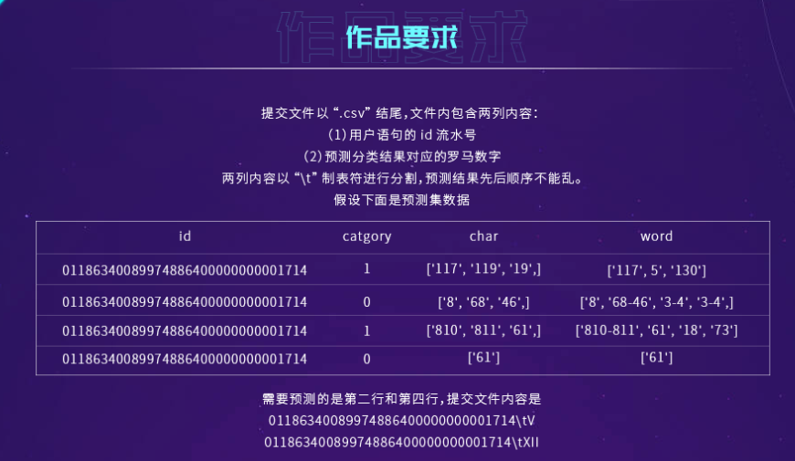
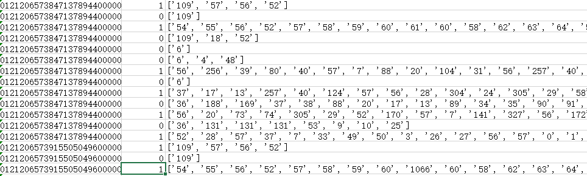
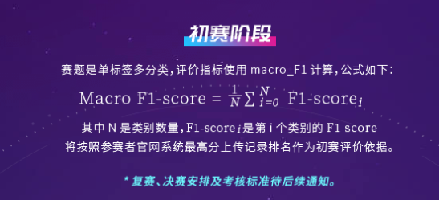
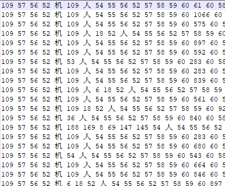
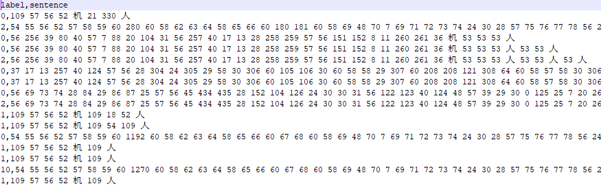

## 2020中国大学生保险数字科技挑战赛

自然语言处理赛道：加密文本情感分类

*这个repo用来保存下游任务的代码，不包含预训练代码*

比赛地址：https://powerattack.gobrand.top/#/proposition

#### 赛题：

判断一轮对话中客户的情感（0为客户，1为机器）

**评测标准：**

#### 方法：

1. 使用加密文本自行预训练一个模型

   数据构造方法为每段对话（一个id）为一个文档（document），利用“机”、“人”这样的special token进行分割。

   

2. 下游任务

   即典型的BERT下游SequenceClassification任务

   数据构造为在一段对话中，每次到“人”标签则停顿，即以最后一个类别为“人”的文本标签为样本标签。

#### 文件结构：

-- data

   -- train.xlsx: 源训练集

   -- pubilic_test.xlsx: 源验证集

-- experiments: 保存训练日志和参数

-- pretrain_model: 需调用的预训练模型

-- ZEN: ZEN([ZEN: Pre-training Chinese Text Encoder Enhanced by N-gram Representations](https://github.com/sinovation/ZEN))model files

-- dataloader.py, dataloader_utils.py

-- evaluate.py: 验证集评估

-- model.py: 下游任务模型

-- predict.py: 预测

-- preprocess.py: 数据预处理

-- train.py: 训练

-- utils.py
